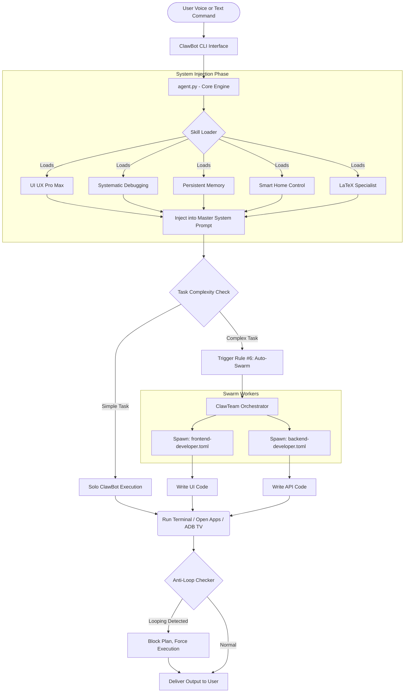

# ClawBot Plus - The Complete Journey (Shuru Se Lekar Ab Tak)
*Last Updated: March 29, 2026*

This document serves as the ultimate history of ClawBot's evolution. What started as a simple terminal AI has now morphed into an autonomous **AGI-like Swarm Leader** that controls your computer, writes senior-level code, and even commands your Smart Home devices.

---

## 🏗️ Phase 1: Core Automation & Creation
*   **Birth of ClawBot:** Developed as an AI-powered Python CLI tool that lives in your terminal (`clawbot`).
*   **Browser & Computer Control:** Integrated libraries like `browser-use`, `pyautogui`, and `pywin32` letting the bot see your screen, click, type, and surf the web exactly like a human.
*   **Voice Control & RAG:** Added `edge-tts` (Text-to-Speech) and `SpeechRecognition` so you can talk to ClawBot directly. Powered it with RAG (Retrieval-Augmented Generation) so it can read local PDFs/Docs.

## 🤖 Phase 2: Swarm Intelligence & Team Leadership
*   **ClawTeam Integration:** Brought in the `ClawTeam` framework. ClawBot is no longer a solo worker. If you give it a big project, it automatically triggers **Rule #6 (Auto-Swarming)** and spawns multiple sub-agents.
*   **Subprocess Backend:** Configured the swarm to use Windows native `subprocess` so it runs smoothly without Docker/Heavy VM configurations.
*   **Anti-Loop Logic (The Brain Fix):** Wrote hard-coded Python logic into `agent.py` (specifically overriding the `todo_write` function) to prevent ClawBot from getting stuck in "infinite planning loops." If it thinks too much, the system forces it to execute code.

## 🎨 Phase 3: Senior-Level Coding Standards
*   **Architecture First:** Banned ClawBot from writing messy single-file projects. It is now strictly commanded to create separate `index.html`, `styles.css`, and `app.js` files.
*   **Premium Quality Enforcement:** The AI is forbidden from using lazy, plain designs. It must employ modern design techniques (dark gradients, smooth transitions, glassmorphism).

## 🏠 Phase 4: Smart Home & IoT Control
*   **The TV Controller:** Taught ClawBot how to interact with the local physical world. Created the `smart_home/SKILL.md`.
*   **ADB Integration:** Built an automatic `Setup-ADB-Auto.bat` installer so ClawBot can ping your Wi-Fi, find your Android TV or Jio Fiber Set-Top Box (e.g., `192.168.31.150`), and control the volume or launch YouTube automatically!

## 🦸‍♂️ Phase 5: The AGI "Superpowers" (March 28-29, 2026)
*   **Global Publication:** Built the `.whl` and `.tar.gz` and successfully published the project to the world as **`clawbot-plus v2.1.0`** on PyPI.
*   **Systematic Debugging Skill:** Injected rules that ban the AI from guessing bug fixes. It must now follow a strict 4-phase "Root Cause Investigation" protocol.
*   **UI/UX Pro Max Skill:** Fed the bot 161 industry-specific styling rules to guarantee absolute perfection in any frontend UI it generates.
*   **Persistent Memory Protocol:** Added Claude-Mem style tracking. ClawBot now maintains an "Observation Timeline" in `task.md` so it never loses context across long sessions.
*   **Swarm Agent Templates:** Hardcoded specialized `frontend-developer.toml` and `backend-developer.toml` templates so ClawBot can assign pure experts to isolated tasks.
*   **LaTeX Specialist Skill:** Added the ability to generate professional, academic-grade PDF reports with native TikZ diagrams, moving away from low-quality placeholders.

---

## 🌟 Key Features (Kya Kya Kar Sakta Hai)

ClawBot Plus is an all-in-one assistant. Here is exactly what it can do for you right now:

1.  **💻 Full PC Control:** Use your mouse, keyboard, and file system automatically.
2.  **🌐 Web Surfing & Research:** Open Chrome/Edge, read websites, solve captchas, and scrape data.
3.  **🗣️ Voice Mode:** Listen to your microphone and speak back using Edge TTS.
4.  **📚 RAG Document Reading:** Read any large PDF or Word document locally to find answers.
5.  **📺 Smart TV Control:** Turn on/off, change volume, or launch apps on your local ADB-connected Jio Set-Top Box or Android TV.
6.  **🧑‍💻 Senior Programming:** Architect complete multi-file web apps following premium UI/UX guidelines and Glassmorphism.
7.  **📄 LaTeX Expert:** Generate professional PDF project reports, academic papers, and flow-diagrams using TikZ (No placeholders!).
8.  **🛸 NVIDIA 2026 Free Models:** Support for latest NIM-hosted endpoints including **Nemotron-3-Super-120B**, **DeepSeek-R1**, **DeepSeek-v3.2**, and **GLM5**.
9.  **🐞 Systematic Debugging:** Hunt down server errors and bug traces using a guaranteed 4-step scientific root-cause protocol.
10. **👯‍♂️ Auto-Swarm Management:** Automatically divide big workloads by spawning sub-agents (Frontend Agent, Backend Agent) to finish the job faster.

---

## ⚙️ Architecture Flow (Ye Kaam Kaise Karta Hai)

This diagram shows how ClawBot processes a user's instruction without hallucinating, by passing through strict filters and splitting tasks among the swarm.

